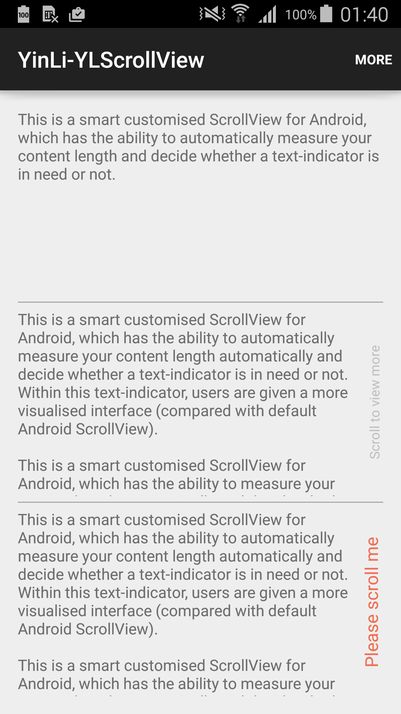
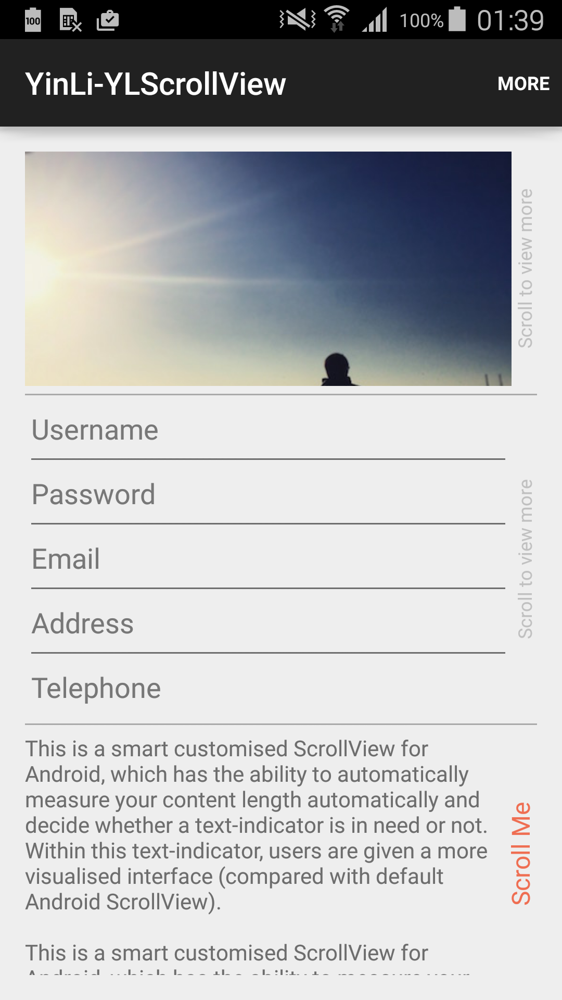

# YLScrollView
This is a smart customised ScrollView for Android, which has the ability to automatically measure your content length and decide whether a text-indicator is in need or not. Within this text-indicator, users are given a more visualised interface (compared with default Android ScrollView).

<b>Here are the demo screenshots:</b>
 

